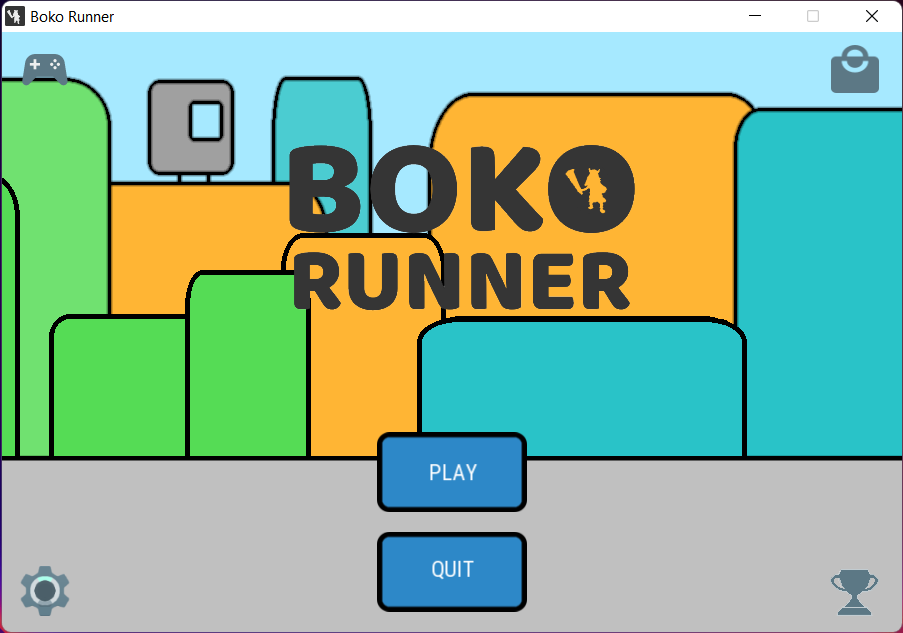

# Boko Runner v2.0-SNAPSHOT #

| Branch | description | version |     CI     |   Code review    |
| ------ |------------ | ------- | ---------- | ---------------- |
| **[main](https://github.com/Bokoblin/DUTS2-OOP-BokoRunner/tree/main)** | Most stable branch  |  | [](https://github.com/Bokoblin/DUTS2-OOP-BokoRunner/actions/workflows/cmake-ubuntu.yml) | [](https://www.codefactor.io/repository/github/bokoblin/duts2-oop-bokorunner/overview/master)
| **dev** | Bleeding edge branch |  | [](https://github.com/Bokoblin/DUTS2-OOP-BokoRunner/actions/workflows/cmake-ubuntu.yml) | [](https://www.codefactor.io/repository/github/bokoblin/duts2-oop-bokorunner/overview/dev) |

### Description ###

Boko Runner is a C++ OOP project done as part of our **DUT** second semester's programming project.
It consisted in creating a "runner" game (an auto-scrolling platform game) where the player 
has to dodge each obstacle and collect bonuses to increase its score. The game ends when the player's life bar is empty.
The project allowed us to put into practice the Object Oriented Programming notions that we learnt in S2.

Initially made to be based on a Model-View architecture as requested, the project can be considered as 
a Multi-Tier Architecture with a persistence manager, an app core, models, and views.

This academic project was initially conducted for 4 months (February - May 2016).
Over the following months and years, some features and "under the hood" improvements were brought for different purposes
(trying new patterns or practises seen in University, maintaining C++ skills, 
attempting to extract an SFML UI library, updating dependencies and broken infrastructure).
Nowadays, the project is mostly dead. But commits can still come from time to time.



### Tools used ###

* Language : C++11
* Unit tests : Google Test
* Continuous integration : Github Actions (previously Travis CI)
* Code review : CodeFactor
* Dependencies : 
    * SFML 2.5.1
    * PugiXML 1.8.1
    * GoogleTest 1.8.1

### Authors ###

* Arthur Jolivet - main developer
* Florian Laronze

### Documentation ###

The Doxygen documentation for the latest stable release (main branch) can be found at 
[this address](https://bokoblin.github.io/DUTS2-OOP-BokoRunner/).

---
### How to build ###

#### Libraries requirements ####

The direct dependencies of the project are fetched using CMake 11+'s FetchContent.<br>
However, you need to manually install SFML's dependencies following the instructions below:

##### GNU/Linux #####

Please first install a compatible compiler (GCC 4.9+/Clang-6+) and CMake 11+.<br>
Installing CMake on Linux can be tricky due to some popular distributions still using old CMake versions.<br>
I recommend directly getting CMake from the official website and adding it to the PATH like below:
```shell
wget -qO- "https://cmake.org/files/v3.17/cmake-3.17.0-Linux-x86_64.tar.gz" | tar --strip-components=1 -xz -C ~/.local
export PATH=~/local/bin:$PATH
```

Then, you thought installing CMake was a pain, obtaining all dependencies of SFML on first try is worse.<br>
Installing `libsfml-dev` and hoping all its dependencies would be installed along is vain.<br>
To help you, here are the steps that worked for me in my attempt to make Travis-CI work for Trusty, Xenial and Bionic:  
```shell
sudo apt-get update -qq
sudo apt-get install -y libxrandr-dev libx11-dev libopenal-dev libalut-dev libvorbis-dev libogg-dev libflac-dev libxcb-image0 libudev-dev libgl1-mesa-dev libegl1-mesa-dev
sudo apt install --reinstall libudev1
```

##### Windows #####

You need to put some shared libraries (.dll) in C:\Windows\System32 or in the same folder as the executable:
- OpenAL32.dll
- sfml-graphics-2.dll or sfml-graphics-d-2.dll
- sfml-window-2.dll or sfml-window-d-2.dll
- sfml-audio-2.dll or sfml-audio-d-2.dll
- sfml-system-2.dll or sfml-system-d-2.dll

Regarding the compiler to pick, I recommend `mingw-w64`, as it's the one I use for this project.

##### MacOS #####

Per tests previously done with Travis CI on MacOS 10.13 and 10.14, it appears installing XCode is all you need.<br>
I have been able to make everything working on a 2018 Macbook Pro (Catalina) with AppleClang 11 with no changes.

#### Building steps ####

##### GNU/Linux #####

Execute `build.sh` file or do, from project folder :
```shell
mkdir build
cd build
cmake .. && make
```

Notes: 
- To accelerate building time, you should set the number of cores to use accordingly to your CPU specs.
- When configuring project with CMake, you can select different options, please refer to the main `CmakeLists.txt` file.

##### Windows #####

Unless you want to be enrolled in a complex process to get the project to eventually run,
I would strongly recommend you to open the project in a CMake compatible IDE (e.g. QTCreator, CLion).
It can analyze the CMake configuration and auto-configure actions to build available binaries.

### How to run ###

##### GNU/Linux #####

The available executables are `bokorunner` and `unit_tests`. <br>
You just have to launch them like you would do with other unix executables: 
```shell
$ ./$PATH_TO_EXEC/$EXEC_NAME
```

##### Windows #####

The available executables are `bokorunner.exe` and `unit_tests.exe`. <br>
You first have to correctly set the current working directory on your IDE (Run>Edit configurations... for Clion) :
- For `bokorunner.exe`, it must be `${PROJECT_DIR}/${CMAKE_BUILD_DIR}`
- For `unit_tests.exe`, it must be `${PROJECT_DIR}/${CMAKE_BUILD_DIR}/src`

Then you can launch them with the built-in `run` option.

---
### Tested environments ###

#### Local environment ####

- **Windows 10 Home Version 1903 - April 2019 Update**
    - **Hardware**: ASUS UX580GD (2018)
	- **Kernel**: Windows NT 10.0
	- **Compilers**: mingw-w64 (x86_64-8.1.0-posix-seh-rt_v6-rev0)
	- **Environment**: Native
	- **Compilation**: OK
	- **Execution**: OK
	- **Unit tests**: OK
	
- **Ubuntu 18.04 LTS - Bionic**
    - **Hardware**: ASUS UX580GD
	- **Kernel**: x86_64 Linux 4.4.0-18362-Microsoft
	- **Compilers**: g++7.5, clang 6.0
	- **Environment**: Windows Subsystem for Linux
	- **Compilation**: OK
	- **Execution**: KO (GUI unsupported on WSL)
	- **Unit tests**: OK

- **MacOS Catalina 10.15.5**
    - **Hardware**: Macbook Pro 2018
	- **Kernel**: Darwin 19.5.0
	- **Compilers**: AppleClang 11.0.3
	- **Environment**: Native
	- **Compilation**: OK
	- **Execution**: OK
	- **Unit tests**: OK
	
#### CI environment ####

##### GitHub Actions (2023+)

At the moment, only Ubuntu is supported.<br>
See [.github/workflows/cmake-ubuntu.yml](.github/workflows/cmake-ubuntu.yml).

##### Travis CI (2017-2020)

See [.travis.yml](.travis.yml) as per used before the organisation & pricing changes.<br>
The following were successfully tested:
- **Ubuntu - Trusty, Xenial, Bionic**
	- **Compilers**: gcc-4.9, gcc-7, gcc-9, clang-6, clang-7, clang-9
	- **Environment**: Virtual machine on GCE (Travis CI)
	- **Compilation**: OK (all 6 compiling)
	- **Execution**: Can't be tested
	- **Unit tests**: OK (all 6 passing)
	
- **Mac OS X 10.13, 10.14**
	- **Compilers**: Xcode 10, Xcode 11
	- **Environment**: Virtual machine on GCE (Travis CI)
	- **Compilation**: OK (both compiling)
	- **Execution**: Can't be tested
	- **Unit tests**: OK (both passing)

---
### Licences ###

The project is essentially licensed under Apache License Version 2.0.<br>
Some exceptions are listed below.

##### Code #####

The included code is licensed under Apache License Version 2.0.<br>
Each C++ header file include at least one Copyright header.<br>
When more are provided, it's due to parts of the code in the class from other authors.  

##### Images #####

Most images are licensed under Apache Licence Version 2.0. This includes:
* original images created by Florian & me
* Material Design (e.g. radios) images inspired by or modified from original images provided by Google.
* AOSP inspired/modified images (e.g. "shape_buttons.png")

The "Moblin" sprite was made by Mister Mike and can be found at 
[this address](https://www.spriters-resource.com/fullview/104058/) .<br>
There is no specific license attached, only the mention "give credit if used".<br>
It is inspired by a character of The Legend of Zelda™, licensed by Nintendo.

The "Morfosfera" sprite is inspired by a character of Metroid™, licensed by Nintendo.

The "Poké ball" sprite is inspired by an object of Pokémon™, licensed by Nintendo.

##### Audio #####

The three following audio files are unlisted sounds licensed by [Midranger](https://soundcloud.com/midrangermusic),
a friend of Florian, under BeerWare license :
- menu_sound.ogg
- game_normal_sound.ogg
- game_master_sound.ogg

All remaining audio files are under Apache Licence Version 2.0.

##### Fonts #####

The fonts come from Google Fonts. They are licensed under Apache Licence Version 2.0.
